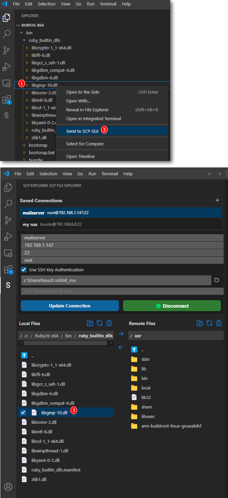

# VS Code SCP GUI

A intuitive VS Code extension for SCP file transfer with a graphical interface, making remote file management simple and efficient.

## ⚠️ IMPORTANT NOTICE ⚠️ 

# *WARNING: LOADING MAY BE SLOW WHEN DIRECTORIES CONTAIN NUMEROUS FILES.*
# *PLEASE  CHOOSE SMALLER DIRECTORIES FOR OPTIMAL PERFORMANCE.*

## Features

- 📁 Graphical File Explorer
- 🔒 Secure SCP/SFTP Transfer
- 🚀 Quick File Upload/Download
- 💾 Server Configuration Management

## Screenshots

## Installation

Search for "VS Code SCP GUI" in the VS Code Extension Marketplace or click [here](https://marketplace.visualstudio.com/items?itemName=houzin.vscode-scp-gui) to install.

## Server Configuration

1. Click the SCP icon in the sidebar
2. Click "+" to add a new server
3. Enter server details:
   - Hostname/IP
   - Username
   - Password/Key File
   - Port (default 22)

## Key Features

### Secure File Transfer

- Support for both password and SSH key authentication
- SFTP protocol enabled by default for file transfers
- Fallback to SCP with OpenSSH protocol (-O flag) when SFTP is not available
- Encrypted file transfer using SCP/SFTP protocols
- Session management for quick reconnection

### File Explorer

- Intuitive graphical interface
- Drag-and-drop file operations
- Multi-file selection support
- Progress indicators for transfers

### Server Management

- Save multiple server configurations
- Quick server switching
- Connection status monitoring
- Automatic reconnection

## Requirements

- VS Code version 1.60.0 or higher
- SSH server access on remote machine
- Network connectivity to remote server

## Important Notes

- Ensure SSH service is running on the server
- SSH key authentication is recommended for better security
- First-time connections require server fingerprint confirmation

## Feedback and Contributions

If you encounter any issues or have feature suggestions, please submit them in [GitHub Issues](https://github.com/houzin/vscode-extension-scp/issues).

## Support

For support, questions, or feature requests, please:

1. Check the [documentation](https://github.com/houzin/vscode-extension-scp/wiki)
2. Search existing [issues](https://github.com/houzin/vscode-extension-scp/issues)
3. Create a new issue if needed

## Disclaimer

This extension is provided "as is" without warranty of any kind, either expressed or implied. While we strive to ensure the security and reliability of file transfers:

- Users are responsible for verifying server authenticity and maintaining secure credentials
- We are not liable for any data loss or security breaches during file transfers
- It is recommended to backup important files before transfer
- Users should ensure they have necessary permissions on both local and remote systems

## License

This project is licensed under the MIT License - see the [LICENSE](LICENSE) file for details.
